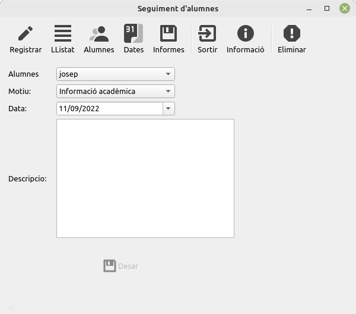
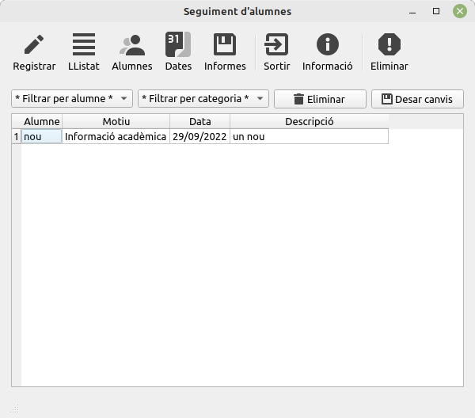

# Manual
## Afegir registres dels alumnes

Es la finestra que us apareixerà en primera instancia.

- **Alumnes:** apareixeran els alumnes previament afegits a la secció Alumnes del programa
- **Motiu**: les categories creades per defecte en l'arxiu config.ini 
- **Data**: creat automaticament. El valor per defecte es la data actual, modificable.
## Llistat

Llistat en format taula dels registres previament introduits. Fent doble clic en algun dels camps permet la seva 
modificacio.
- **Filtrar per alumne**: visualitzar els registres d'algun dels alumnes amb algun registre introduit.
- **Filtrar per categoria**: visualitzar nomes els registres d'algun motiu en concret.
- **Eliminar**: eliminar un registre.
- **Desar**: desar qualsevol modificacio que s'hagi fet en algun registre, inclosa l'eliminacio del mateix. 
  **Obligatori per a que es desin.**

## Alumnes
